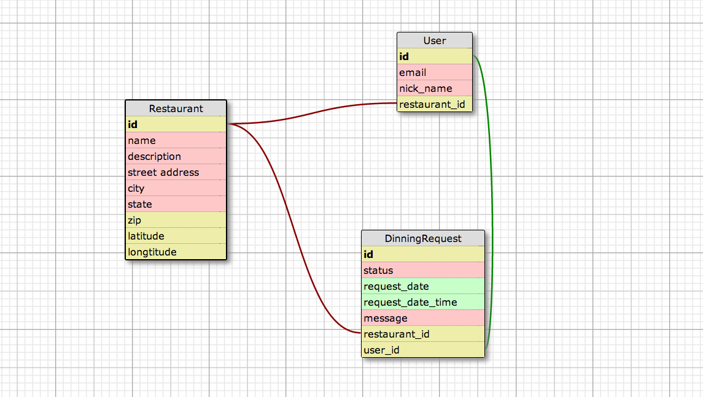

1. Users can create an account
2. Users can search for relevant Restaurants
3. As a Host, I am willing to cook for guest in my spare time, I can create a Restaurant
4. In the Listing, specify which meal on which date I am willing to welcome additonal guest.
5. As a Guest looking for a place to have dinner; I can create a DinningRequest for a specific Restaurant on a particular date and time.

MODELS:

User
- id
- email
- password
- nick_name
has_one Restaurant

Kitchen
- id
- name
- description
- street address
- city
- state
- zip
- latitude
- longtitude
belongs_to User
has_n DinningRequests

DinningRequest
- id
- status
- request_date_time
- message, Text
- belongs_to User
- belongs_to Restaurant

